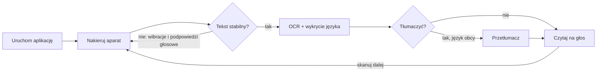

# PRD MVP – Czytnik Głosowy

Stan na: 2026-09-26 · Autor: Damian · Wersja robocza (żywa wersja): https://claude.ai/code/artifact/01c0d5bb-67ed-4afa-8905-2d93e21cca5e

## Kontekst i problem

Czytnik Głosowy to aplikacja na Androida, która po uruchomieniu sama czyta na głos tekst widoczny w aparacie, opcjonalnie po przetłumaczeniu. MVP ma udowodnić jedno: osoba słabowidząca usłyszy tekst z kartki, etykiety lub tabliczki bez szukania przycisków.

Dla wielu osób przeczytanie tekstu jest barierą:

- **Słabowidzący i niewidomi** – drobny druk (ulotki leków, etykiety, paragony, rachunki) jest dla nich nieczytelny.
- **Osoby, które nie czytają** – analfabetyzm funkcjonalny, dysleksja, afazja, dzieci, seniorzy po udarze.
- **Tekst w obcym języku** – instrukcje, menu, szyldy za granicą lub w dokumentach od obcokrajowców.

Istniejące narzędzia (aparat z lupą, Google Lens, Tłumacz Google) wymagają wielu kroków: wybór trybu, zrobienie zdjęcia, zaznaczenie tekstu, kliknięcie „Słuchaj”. Każdy krok to mały przycisk, który osoba z problemami ze wzrokiem musi znaleźć. Nasz produkt odwraca to: domyślnym stanem jest czytanie, a dotyk służy tylko do przerwania lub powtórzenia.

## Cele MVP i miary sukcesu

Cel MVP: od uruchomienia aplikacji do usłyszenia tekstu w mniej niż 5 sekund i przy zerowej liczbie dotknięć.

| Miara | Cel MVP | Jak mierzymy |
| --- | --- | --- |
| Dotknięcia do pierwszego odczytu (po nadaniu uprawnień) | 0 | Test z użytkownikami, scenariusz „przeczytaj ulotkę” |
| Czas: uruchomienie → początek mowy (tekst polski, bez tłumaczenia) | ≤ 5 s (p75) | Pomiar w aplikacji, średnie urządzenie |
| Czas z tłumaczeniem (model już pobrany) | ≤ 7 s (p75) | Pomiar w aplikacji |
| Poprawność OCR dla druku ≥ 10 pt, dobre światło | ≥ 95% znaków | Zestaw 30 zdjęć testowych |
| Zadanie wykonane samodzielnie przez osobę słabowidzącą | ≥ 8 z 10 osób | Testy z użytkownikami (np. przez PZN) |
| Niechciane powtórzenia tego samego tekstu | 0 na sesję | Test z użytkownikami |

MVP jest sukcesem, gdy osoby z grupy docelowej używają go bez pomocy osoby widzącej i chcą z niego korzystać dalej.

## Użytkownicy docelowi

Główna grupa MVP to osoby słabowidzące; pozostałe grupy korzystają z tego samego przepływu bez dodatkowych funkcji.

| Persona | Sytuacja | Czego potrzebuje | Priorytet w MVP |
| --- | --- | --- | --- |
| Halina, 74 l., zwyrodnienie plamki (AMD) | Nie przeczyta ulotki leku ani rachunku, nie używa TalkBack | Duży przycisk, automatyczne czytanie, głośno i wolno | Wysoki |
| Marek, 38 l., niewidomy | Korzysta z TalkBack, nie widzi, gdzie jest tekst | Wskazówki dźwiękowe i wibracje do nakierowania aparatu, pełna zgodność z TalkBack | Wysoki |
| Olena, 45 l., z Ukrainy | Dobrze widzi, ale nie czyta po polsku | Polski tekst przeczytany po ukraińsku | Średni |
| Tomek, 30 l., dysleksja | Czytanie dłuższych tekstów męczy | Szybki odczyt, powtórzenie, tekst na ekranie dużą czcionką | Średni |
| Damian, 45 l., bardzo wąskie pole widzenia | Czyta komiksy online w aplikacji Marvela na tablecie; nawet w okularach potrzebuje lupy, a nie każde angielskie słowo rozumie | Telefon skierowany na ekran tabletu czyta wybrany dymek po angielsku lub przetłumaczony na polski | Wysoki |

## Główny scenariusz

Użytkownik uruchamia aplikację, kieruje aparat na tekst i słyszy go – bez żadnego dotknięcia. Aparat startuje od razu, a aplikacja wita krótkim komunikatem głosowym.

Ten sam tekst jest czytany tylko raz; aplikacja czyta ponownie dopiero, gdy aparat zobaczy coś innego lub użytkownik naciśnie „Powtórz”. Dotknięcie w dowolnym miejscu ekranu zatrzymuje mowę albo wymusza odczyt od razu.

## Wymagania funkcjonalne

MVP obejmuje wszystkie wymagania „Must”; „Should” wchodzą, jeśli nie opóźnią wydania.

| ID | Wymaganie | Kryterium akceptacji | Priorytet |
| --- | --- | --- | --- |
| F1 | Aparat startuje od razu po uruchomieniu | Podgląd aktywny ≤ 1,5 s od otwarcia; brak ekranu startowego | Must |
| F2 | Automatyczny odczyt po ustabilizowaniu kadru | Tekst widoczny i niezmienny przez ok. 1 s → sygnał dźwiękowy i start czytania | Must |
| F3 | Rozpoznawanie tekstu (OCR) na urządzeniu | Pismo łacińskie (m.in. PL, EN, DE, FR, ES); zdjęcie w wysokiej rozdzielczości przed odczytem | Must |
| F4 | Naturalna kolejność czytania | Bloki od góry do dołu, kolumny od lewej; scalenie linii i przeniesień wyrazów | Must |
| F5 | Automatyczne wykrycie języka tekstu | Głos TTS dobrany do wykrytego języka; gdy brak głosu – komunikat i głos domyślny | Must |
| F6 | Czytanie na głos (TTS) | Długie teksty dzielone na fragmenty; pauza między akapitami | Must |
| F7 | Stop / czytaj teraz jednym dotknięciem | Dotknięcie ekranu lub dużego przycisku zatrzymuje mowę albo wymusza odczyt | Must |
| F8 | Powtórz ostatni tekst | Jeden przycisk; działa także po zatrzymaniu | Must |
| F9 | Tłumaczenie opcjonalne | Przełącznik „Tłumacz”; gdy włączony i język ≠ docelowy, czytany jest przekład. Przełączenie po odczycie od razu czyta ten sam tekst ponownie | Must |
| F10 | Wybór języka docelowego | Domyślnie język telefonu; lista języków w ustawieniach | Must |
| F11 | Brak powtórzeń tego samego tekstu | Tekst już przeczytany nie jest czytany ponownie, dopóki aparat go nie opuści | Must |
| F12 | Tempo mowy | Przyciski „Wolniej / Szybciej”, zakres 0,5–2,0×, próbka po zmianie | Should |
| F13 | Latarka | Przycisk włącz/wyłącz; automatyczne włączenie przy słabym świetle | Should |
| F14 | Tekst na ekranie dużą czcionką | Przeczytany tekst widoczny (≥ 26 sp, biały na czarnym), przewijany | Should |
| F15 | Tryb ręczny | Ustawienie wyłączające automatyczny odczyt (czyta tylko po dotknięciu) | Should |
| F16 | Czytanie zdjęcia z innej aplikacji | „Udostępnij → Czytnik Głosowy” dla obrazów z galerii | Could |
| F17 | Pisma niełacińskie | Chińskie, japońskie, koreańskie, dewanagari – automatyczny wybór | Could |

## Wymagania dostępności

Aplikacja musi być w pełni używalna bez patrzenia na ekran oraz dla osób z resztkami wzroku; to warunek wydania, nie dodatek.

- **Obsługa bez wzroku** – każdy stan aplikacji (szukam tekstu, czytam, tłumaczę, brak tekstu, błąd) jest ogłaszany głosem lub dźwiękiem.
- **Nakierowanie aparatu** – lekkie wibracje, gdy tekst jest w kadrze; podpowiedź głosowa, gdy tekst wychodzi poza krawędź („Odsuń telefon”) lub gdy przez ok. 10 s nie ma tekstu.
- **TalkBack** – wszystkie elementy mają opisy, poprawną kolejność fokusu i stan (np. „Tłumaczenie, włączone”). Brak gestów kolidujących z TalkBack.
- **Duże cele dotyku** – min. 76 dp wysokości, główny przycisk na całą szerokość; cały podgląd aparatu działa jak jeden przycisk.
- **Kontrast** – czarne tło, żółte i białe elementy, kontrast ≥ 7:1 (WCAG AAA); brak informacji przekazywanej tylko kolorem.
- **Tekst** – min. 22 sp, pogrubiony na przyciskach; interfejs respektuje systemowe powiększenie czcionki do 200% bez obcinania.
- **Prosty język** – krótkie komunikaty, bez żargonu („Nie widzę tekstu”, nie „OCR zwrócił pusty wynik”).
- **Ekran nie gaśnie** podczas pracy aplikacji; orientacja pionowa.
- **Uprawnienia** – prośba o aparat objaśniona głosem; po odmowie jeden duży przycisk „Otwórz ustawienia”.

## Wymagania niefunkcjonalne

Rozpoznawanie i czytanie działają w pełni offline; sieć jest potrzebna tylko do jednorazowego pobrania modelu tłumaczenia.

| Obszar | Wymaganie |
| --- | --- |
| Offline | OCR, wykrywanie języka i TTS działają bez internetu. Model tłumaczenia (ok. 30 MB na język) pobierany raz, z komunikatem głosowym |
| Prywatność | Obrazy i teksty nie opuszczają telefonu, nie są zapisywane. Brak konta, reklam i analityki w MVP |
| Wydajność | Analiza kadru co ok. 350 ms; podczas czytania analiza wstrzymana (bateria, temperatura) |
| Urządzenia | Android 8.0+ (API 26), tylny aparat z autofokusem; test na min. 3 telefonach, w tym 1 budżetowym |
| Rozmiar | APK ≤ 60 MB (modele OCR wbudowane) |
| Niezawodność | Brak głosu TTS lub modelu nie blokuje działania: aplikacja mówi, co jest nie tak, i czyta oryginał głosem domyślnym |
| Języki interfejsu | Polski i angielski |

## Proponowane rozwiązanie techniczne

Natywna aplikacja Android (Kotlin, Jetpack Compose) oparta wyłącznie na bezpłatnych komponentach działających na urządzeniu – bez własnego serwera i kosztów API.

| Warstwa | Komponent | Uwagi |
| --- | --- | --- |
| Aparat | CameraX (podgląd, analiza klatek, zdjęcie) | Analiza ok. 1280×720, zdjęcie do odczytu ok. 2560×1440 |
| OCR | Google ML Kit Text Recognition v2 | Modele wbudowane w APK; osobne modele dla łacińskiego, chińskiego, japońskiego, koreańskiego, dewanagari |
| Wykrycie języka | ML Kit Language Identification | Ponad 100 języków; krótkie teksty często „nieokreślony” |
| Tłumaczenie | ML Kit Translation (on-device) | Ok. 50 języków, darmowe, bez klucza API; te same modele co tryb offline Tłumacza Google. Dla EN → PL wystarczy model polski (ok. 30 MB, pobierany raz), angielski jest wbudowany. Modeli pobranych w aplikacji Tłumacz Google nie da się użyć – nie są udostępniane innym aplikacjom. Jakość niższa niż Tłumacz Google online |
| Mowa | Android TextToSpeech | Dostępne głosy zależą od silnika w telefonie (np. Google Speech Services) |
| UI | Jetpack Compose, motyw wysokiego kontrastu | Jeden ekran główny + ustawienia |

**Ograniczenia do potwierdzenia przed startem prac:**

- ML Kit prawdopodobnie nie rozpoznaje cyrylicy, arabskiego ani hebrajskiego – „dowolny język” w MVP oznacza języki pisane alfabetem łacińskim oraz CJK i dewanagari.
- Pismo odręczne jest rozpoznawane słabo; MVP celuje w druk.
- Na telefonach bez usług Google głosy TTS i pobieranie modeli tłumaczeń mogą nie działać.

## Poza zakresem MVP

Poniższe funkcje są wartościowe, ale nie są potrzebne, by sprawdzić główną hipotezę:

- iOS i wersja webowa.
- Opisywanie obrazów i scen („co jest przede mną”), rozpoznawanie banknotów, kolorów, kodów kreskowych.
- Pismo odręczne, cyrylica, alfabety arabski i hebrajski.
- Tłumaczenie w chmurze i modele AI online (lepsza jakość, ale koszty i prywatność).
- Historia odczytanych tekstów, zapis do pliku, udostępnianie tekstu.
- Sterowanie głosem („czytaj”, „powtórz”) i przyciskami głośności.
- Lupa z powiększeniem i filtrami kontrastu obrazu.
- Czytanie wielostronicowych dokumentów i PDF.
- Konta użytkowników, synchronizacja, płatności.

## Ryzyka, otwarte pytania i kolejne kroki

Największe ryzyko to trafianie aparatem w tekst przez osoby niewidome; trzeba je sprawdzić z użytkownikami jak najwcześniej.

| Ryzyko | Wpływ | Jak ograniczamy |
| --- | --- | --- |
| Osoba niewidoma nie potrafi nakierować aparatu | Wysoki | Wibracje i podpowiedzi głosowe; test na prototypie w pierwszych 2 tygodniach |
| Auto-odczyt startuje w złym momencie (np. przypadkowy napis w tle) | Średni | Wymóg stabilności kadru i min. długości tekstu; tryb ręczny w ustawieniach |
| Brak głosu TTS dla wykrytego języka | Średni | Komunikat i głos domyślny; skrót do ustawień syntezatora |
| Niska jakość OCR przy słabym świetle lub drobnym druku | Średni | Zdjęcie w wysokiej rozdzielczości, automatyczna latarka |
| Kolizja własnych komunikatów z TalkBack (podwójna mowa) | Średni | Testy z TalkBack; ewentualnie ograniczenie komunikatów, gdy TalkBack jest włączony |

**Otwarte pytania**

- [ ] Czy cyrylica (ukraiński, rosyjski) jest wymagana w MVP? Jeśli tak, potrzebny inny silnik OCR (np. Tesseract).
- [ ] Czy po odczycie przetłumaczonego tekstu czytać też oryginał, czy tylko przekład?
- [ ] Z jaką organizacją prowadzimy testy (np. Polski Związek Niewidomych)?
- [ ] Dystrybucja: Google Play od razu czy najpierw testy zamknięte?

**Kolejne kroki**

1. Akceptacja PRD i odpowiedzi na otwarte pytania.
2. Test z Damianem (1 dzień): Tłumacz Google w trybie samolotowym na kilku stronach komiksu Marvela na tablecie. Czy tłumaczenie offline EN → PL mu wystarcza? Jeśli nie – rozważyć płatne tłumaczenie w chmurze (Google Cloud Translation).
3. Klikalny prototyp głównego ekranu + test z 3–5 osobami słabowidzącymi.
4. Implementacja wymagań „Must” i wersja testowa (APK).
5. Testy z użytkownikami wg miar z sekcji „Cele MVP” i decyzja o wydaniu.
