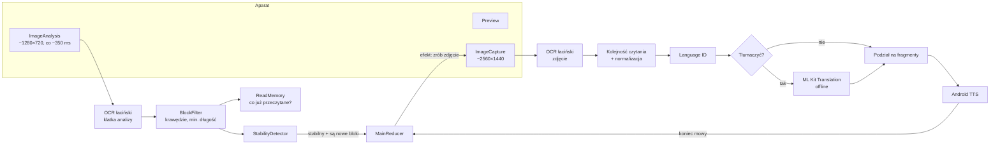
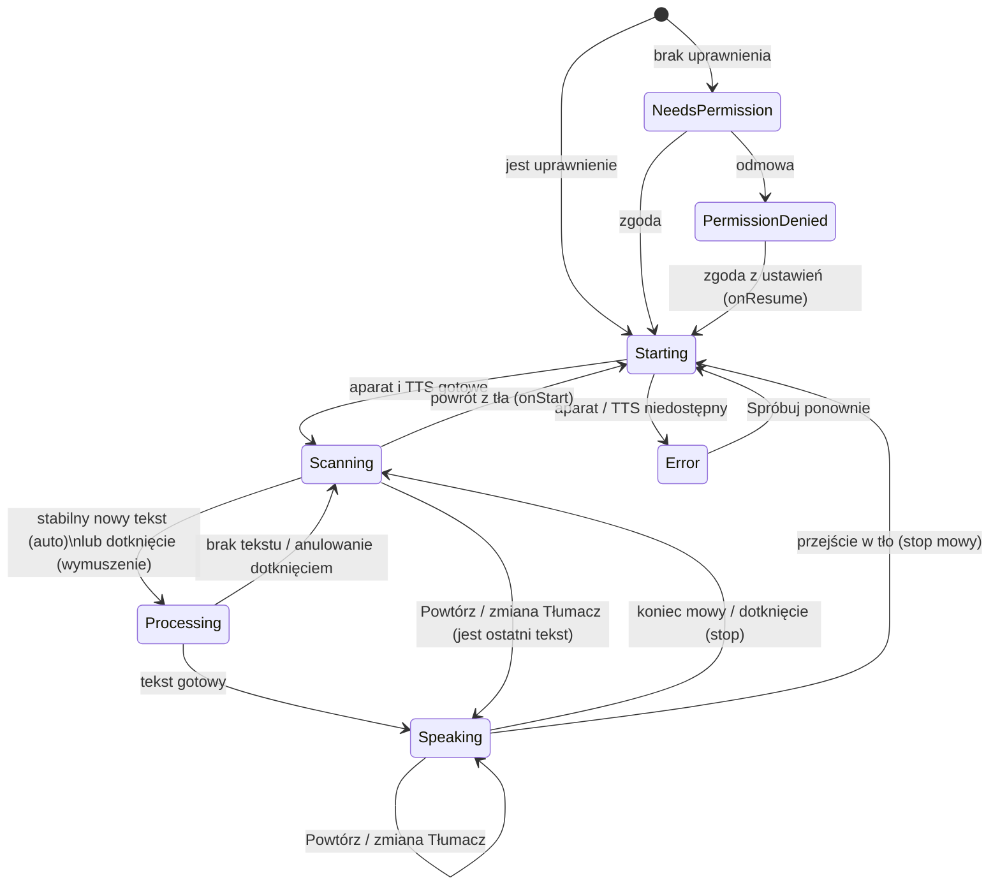

# Specyfikacja techniczna MVP – Czytnik Głosowy

Stan na: 2026-09-26 · Status: **do akceptacji** · Podstawa: [PRD-MVP.md](PRD-MVP.md)

Dokument opisuje, jak zbudować MVP opisane w PRD. Kodu aplikacji jeszcze nie ma – najpierw akceptujemy ten spec.
Numery wymagań (F1…F17) odnoszą się do tabeli „Wymagania funkcjonalne” w PRD.

Pierwszy użytkownik i główny scenariusz odbiorczy to **Damian**: czyta komiksy Marvela na tablecie, a telefon kieruje
na ekran tabletu – scena po scenie, jeden dymek w kadrze. Dziś robi to w Tłumaczu Google (3 kliknięcia na dymek).
Cel: **zero kliknięć** – telefon sam czyta nowy dymek po angielsku albo po polsku.

---

## 0. Najważniejsze decyzje w skrócie

| # | Decyzja | Uzasadnienie |
| --- | --- | --- |
| D1 | Dwa moduły: czysty Kotlin/JVM `core` (cała logika) + Androidowy `app` (adaptery, UI) | Logikę da się testować bez Androida, także w środowisku chmurowym bez Android SDK |
| D2 | `core` jako **osobny build Gradle** włączany przez `includeBuild` | Build `core` nie wymaga Google Maven (dl.google.com), więc `./gradlew -p core test` działa w chmurze |
| D3 | Ekran główny sterowany maszyną stanów typu reduktor: `(Stan, Zdarzenie) → (Stan, Efekty)` | Deterministyczna, w 100% testowalna na JVM; ViewModel tylko wykonuje efekty |
| D4 | Auto-odczyt: stabilność liczona na tekście z klatek analizy (≈ co 350 ms), **deduplikacja na poziomie bloków** (dymków) | Przy przesuwaniu telefonu po stronie komiksu czytamy tylko nowy dymek, a nie ponownie sąsiedni |
| D5 | Bloki ucięte krawędzią kadru są pomijane (gdy w kadrze jest też pełny blok) | Kawałek sąsiedniego dymka nie jest czytany; gdy wszystko jest ucięte → „Odsuń telefon” |
| D6 | Tekst pisany WIELKIMI LITERAMI (komiksy) normalizujemy do zdań przed tłumaczeniem i TTS | Lepsza jakość tłumaczenia i wymowy; do weryfikacji na zestawie Damiana (przełącznik w kodzie) |
| D7 | Zdjęcie wysokiej rozdzielczości przed odczytem – **włączone domyślnie, ale jako parametr** | PRD tego wymaga (F3); dla dużych liter na ekranie tabletu klatka analizy może wystarczyć i być szybsza – rozstrzygamy pomiarem |
| D8 | Tłumaczenie: ML Kit Translation offline; model języka docelowego pobierany w chwili włączenia „Tłumacz” | Zgodnie z ustaleniami; Cloud Translation tylko, jeśli test z Damianem wypadnie źle |
| D9 | Automatyczna latarka: domyślnie włączona, ale ręczne wyłączenie blokuje auto-włączanie do końca sesji + osobne ustawienie | Odblask na szkle tabletu |
| D10 | Komunikaty stanu: przy włączonym TalkBack przez `liveRegion` (mówi TalkBack), bez TalkBack – nasz TTS. Treść czytanego tekstu zawsze naszym TTS | Brak podwójnej mowy |
| D11 | CI: GitHub Actions buduje debug APK jako artefakt; **wspólny debug keystore w repozytorium** | Kolejne APK instalują się „na” poprzednie bez odinstalowania (inaczej Damian traci pobrany model i ustawienia) |
| D12 | Pierwsze APK dla Damiana już w etapie 2 (auto-odczyt EN bez tłumaczenia), tłumaczenie w etapie 3 | Najszybsza możliwa informacja zwrotna o najbardziej ryzykownym elemencie – trafianiu w dymek i powtórzeniach |

---

## 1. Architektura

### 1.1 Moduły i pakiety

```
ocr-reader-voice/
├── settings.gradle.kts          # include(":app"), includeBuild("core")
├── gradle/libs.versions.toml    # katalog wersji
├── core/                        # osobny build Gradle, czysty Kotlin/JVM – ZERO zależności od Androida
│   ├── settings.gradle.kts
│   └── src/main/kotlin/pl/czytnik/core/
│       ├── model/        # TextBlock, TextLine, BoundingBox, OcrFrame, LanguageTag, ReadingText
│       ├── text/         # TextNormalizer (łączenie linii, przeniesienia, WIELKIE LITERY), ReadingOrder (XY-cut),
│       │                 # Similarity (Dice na trigramach), TextChunker (podział dla TTS)
│       ├── autoread/     # StabilityDetector, ReadMemory (deduplikacja bloków), BlockFilter (krawędzie, min. długość),
│       │                 # GuidanceAdvisor (kiedy „Nie widzę tekstu”, „Odsuń telefon”, wibracja)
│       ├── language/     # LanguageResolver (fallback dla „nieokreślony”), TranslationPolicy
│       ├── state/        # MainState, MainEvent, MainEffect, MainReducer
│       ├── pipeline/     # ReadPipeline – orkiestracja OCR → język → tłumaczenie → mowa na portach (interfejsach)
│       ├── ports/        # interfejsy: TextRecognizer, LanguageIdentifier, Translator, TranslationModels,
│       │                 # SpeechOutput, Clock
│       └── config/       # AutoReadConfig – wszystkie parametry do strojenia w jednym miejscu
└── app/                         # moduł Android (Compose), zależy od core
    └── src/main/kotlin/pl/czytnik/app/
        ├── MainActivity.kt
        ├── main/         # MainViewModel (trzyma reduktor, wykonuje efekty), MainScreen (Compose)
        ├── camera/       # CameraController (CameraX), FrameAnalyzer, PhotoCapturer, TorchController, LumaMeter
        ├── ocr/          # MlKitTextRecognizer : TextRecognizer (mapowanie ML Kit → core.model)
        ├── language/     # MlKitLanguageIdentifier : LanguageIdentifier
        ├── translate/    # MlKitTranslator : Translator, MlKitTranslationModels : TranslationModels
        ├── speech/       # AndroidSpeechOutput : SpeechOutput (TextToSpeech), VoiceSelector
        ├── feedback/     # Haptics, Earcons, Announcer (TTS albo liveRegion zależnie od TalkBack)
        ├── settings/     # SettingsRepository (DataStore), SettingsScreen
        ├── permission/   # obsługa uprawnienia aparatu
        ├── ui/theme/     # motyw wysokiego kontrastu, typografia, wymiary
        └── diagnostics/  # pomiary czasów (tylko lokalnie, bez analityki)
```

Zasada podziału: **wszystko, co jest decyzją, siedzi w `core`**; `app` tylko tłumaczy Androida/ML Kit na typy z `core`
i wykonuje efekty. Pakiet `pl.czytnik` jest roboczy – do potwierdzenia razem z `applicationId` (rozdz. 9).

### 1.2 Odpowiedzialności kluczowych klas

| Klasa | Odpowiedzialność |
| --- | --- |
| `MainReducer` (core) | Czysta funkcja przejść stanów ekranu głównego; zwraca listę efektów (mów, wibruj, zrób zdjęcie, wstrzymaj analizę…) |
| `StabilityDetector` (core) | Na podstawie kolejnych `OcrFrame` z analizy stwierdza „tekst stabilny od ≥ 1 s” |
| `ReadMemory` (core) | Pamięta przeczytane bloki, mówi, które bloki w kadrze są nowe; „uzbraja” blok ponownie, gdy opuścił kadr |
| `ReadPipeline` (core) | Dla wybranych bloków: kolejność → normalizacja → język → (tłumaczenie) → podział na fragmenty → `SpeechOutput` |
| `MainViewModel` (app) | Łączy strumień klatek z reduktorem, wykonuje efekty w korutynach, udostępnia `StateFlow<MainUiState>` dla Compose |
| `CameraController` (app) | Wiąże CameraX z cyklem życia; Preview + ImageAnalysis + ImageCapture we wspólnym `ViewPort` |
| `AndroidSpeechOutput` (app) | Opakowuje `TextToSpeech` w API na korutynach; dobór głosu; kolejka fragmentów; zatrzymanie |
| `Announcer` (app) | Jedno miejsce na komunikaty stanu; wybiera kanał (TTS / `liveRegion`) zależnie od TalkBack |

### 1.3 Przepływ danych



Przebieg jednego odczytu (auto-odczyt):

1. `ImageAnalysis` dostarcza klatki; `FrameAnalyzer` przepuszcza co najwyżej jedną na ~350 ms (strategia `KEEP_ONLY_LATEST`).
2. OCR na klatce analizy → `OcrFrame` (bloki z ramkami we współrzędnych znormalizowanych 0..1, po uwzględnieniu obrotu).
3. `BlockFilter` odrzuca bloki ucięte krawędzią i zbyt krótkie; `ReadMemory` oznacza bloki już przeczytane.
4. `StabilityDetector` zgłasza stabilność → reduktor przechodzi do `Processing` i emituje `CapturePhoto` oraz wibrację/sygnał.
5. OCR na zdjęciu → dopasowanie bloków zdjęcia do nowych bloków z analizy (te same filtry, ta sama pamięć).
   Gdy OCR zdjęcia nic nie zwróci – używamy tekstu z klatki analizy.
6. Kolejność czytania, normalizacja, wykrycie języka, ewentualne tłumaczenie, podział na fragmenty.
7. TTS; na czas mowy analiza jest **wstrzymana** (PRD: bateria, temperatura). Po zakończeniu mowy – powrót do skanowania.

Wszystkie wywołania ML Kit i TTS są asynchroniczne (`Task.await()` z `kotlinx-coroutines-play-services`),
wykonywane w `viewModelScope`; przetwarzanie jednego odczytu to jeden anulowalny `Job` (dotknięcie = `cancel()`).

---

## 2. Maszyna stanów ekranu głównego

### 2.1 Stany

| Stan | Opis | Analiza klatek | Co słychać / czuć |
| --- | --- | --- | --- |
| `NeedsPermission` | Brak uprawnienia do aparatu (pierwsze uruchomienie) | – | Objaśnienie głosem, potem systemowe okno zgody |
| `PermissionDenied` | Odmowa uprawnienia | – | „Bez aparatu nie mogę czytać. Naciśnij Otwórz ustawienia.” |
| `Starting` | Wiązanie aparatu, inicjalizacja TTS | – | – |
| `Scanning(sub)` | Szukanie tekstu; `sub` = `NoText` / `TextUnstable` / `AllRead` / `Manual` | tak | Wibracja przy pojawieniu się tekstu, podpowiedzi głosowe |
| `Processing(step)` | Zdjęcie → OCR → język → tłumaczenie; `step` do wyświetlenia i ogłoszenia | nie | Sygnał dźwiękowy startu; „Tłumaczę…” jeśli trwa > 1,5 s |
| `Speaking(text)` | Czytanie fragmentów | nie | Mowa |
| `Error(kind)` | Błąd blokujący: aparat niedostępny, brak silnika TTS | – | Komunikat + co zrobić |

Błędy **nieblokujące** (brak głosu dla języka, brak modelu tłumaczenia, brak sieci przy pobieraniu) nie są osobnym stanem:
reduktor emituje komunikat i czyta oryginał / głosem domyślnym (PRD: „Niezawodność”).

`Starting` trwa zwykle < 1 s. Powitanie („Czytnik gotowy. Skieruj aparat na tekst.”) jest emitowane przy wejściu do
`Scanning`, a pierwszy odczyt je przerywa – nie może opóźniać celu „≤ 5 s”. Przy kolejnych uruchomieniach powitanie
skracamy do „Gotowe”.

### 2.2 Diagram



### 2.3 Obsługa dotyku i przycisków w każdym stanie

„Podgląd” = cały obszar podglądu aparatu (jeden duży przycisk, PRD). Przyciski – zob. rozdz. 5.

| Stan | Dotknięcie podglądu | Powtórz | Tłumacz (przełącznik) | Wolniej / Szybciej | Latarka |
| --- | --- | --- | --- | --- | --- |
| `Scanning` | **Czytaj teraz**: zdjęcie i odczyt wszystkich pełnych bloków w kadrze, z pominięciem stabilności i pamięci przeczytanych; brak tekstu → „Nie widzę tekstu” | Czyta ostatni tekst (w bieżącym trybie tłumaczenia); brak → „Nic jeszcze nie przeczytałem” | Przełącza; jeśli jest ostatni tekst → czyta go od razu w nowym trybie (F9) | Zmienia tempo, mówi próbkę „Tempo 1,25” | Przełącza; ręczne wyłączenie blokuje auto-latarkę do końca sesji |
| `Processing` | **Anuluj**: przerywa zadanie, tekst oznaczony jako przeczytany (nie wróci automatycznie), „Zatrzymano” | Anuluje bieżące i czyta ostatni tekst | Przełącza; bieżące przetwarzanie użyje nowego ustawienia | Zmienia tempo (bez próbki) | Przełącza |
| `Speaking` | **Stop**: `tts.stop()`, powrót do `Scanning`; tekst zostaje przeczytany (brak ponownego auto-odczytu) | Czyta ostatni tekst od początku | Przełącza i czyta ten sam tekst od nowa w nowym trybie | Zmienia tempo od następnego fragmentu (bez próbki) | Przełącza |
| `NeedsPermission` / `PermissionDenied` | – (jedyny przycisk: „Udziel dostępu” / „Otwórz ustawienia”) | ukryty | ukryty | ukryte | ukryta |
| `Error` | „Spróbuj ponownie” | ukryty | aktywny | aktywne | ukryta |

Tryb ręczny (F15) = `Scanning(Manual)`: stabilność nie uruchamia odczytu, dotknięcie podglądu – tak. Wibracja przy
pojawieniu się tekstu nadal działa (pomaga nakierować).

Cykl życia: `onStop` → zatrzymanie mowy, anulowanie przetwarzania, odpięcie aparatu (CameraX robi to przez lifecycle),
wyłączenie latarki. `onStart` → `Starting`. Pamięć przeczytanych bloków czyścimy po powrocie z tła dłuższym niż 60 s.

### 2.4 Kształt kodu

```kotlin
// core
sealed interface MainEvent { data class FrameAnalyzed(val frame: OcrFrame) : MainEvent; object ScreenTapped : MainEvent; … }
sealed interface MainEffect { object CapturePhoto : MainEffect; data class Speak(val chunks: List<SpeechChunk>) : MainEffect;
                              data class Announce(val message: Message) : MainEffect; data class Vibrate(val kind: HapticKind) : MainEffect; … }
fun reduce(state: MainState, event: MainEvent, now: Long, config: AutoReadConfig): Pair<MainState, List<MainEffect>>
```

Czas jest parametrem (`now`), nie odczytem zegara – testy są deterministyczne.

---

## 3. Algorytm auto-odczytu

### 3.1 Od klatki do „bloku”

Dla każdej klatki analizy:

1. **OCR** (model łaciński). Każdy blok ML Kit → `TextBlock(text, box, lines)`; ramki normalizowane do 0..1 w układzie
   „tak jak widzi użytkownik” (po obrocie).
2. **Filtr jakości**: odrzucamy linie o `confidence < 0,5` (ML Kit v2 udostępnia pewność linii) i bloki z mniej niż
   `MIN_LETTERS` liter.
3. **Filtr krawędzi**: blok, którego ramka dotyka marginesu `EDGE_MARGIN` przy krawędzi kadru, jest „ucięty”.
   Jeśli w kadrze jest ≥ 1 blok pełny – ucięte pomijamy. Jeśli wszystkie są ucięte – nie czytamy automatycznie,
   a po `EDGE_HINT_MS` mówimy „Odsuń telefon”. (Wymuszony odczyt dotknięciem czyta wtedy także bloki ucięte.)
4. **Normalizacja do porównań**: małe litery, tylko litery i cyfry, pojedyncze spacje. Podobieństwo dwóch tekstów =
   współczynnik Dice’a na trigramach znakowych (odporny na drobne błędy OCR, O(n)).

### 3.2 Kiedy kadr jest stabilny

Kadr jest stabilny, gdy przez `STABLE_WINDOW_MS` wszystkie kolejne klatki analizy (min. `STABLE_MIN_FRAMES`) spełniają:

- podobieństwo połączonego tekstu pełnych bloków do poprzedniej klatki ≥ `STABLE_SIMILARITY`,
- środek prostokąta obejmującego wszystkie pełne bloki przesunął się o ≤ `MAX_CENTER_SHIFT` (ułamek przekątnej kadru),
- zestaw pełnych bloków zawiera co najmniej jeden **nieprzeczytany** blok (zob. 3.3).

Każda klatka łamiąca warunek zeruje okno. Brak czujników ruchu w MVP – tekst i jego położenie wystarczają; jeśli testy
pokażą fałszywe starty podczas przesuwania telefonu, dodamy żyroskop jako dodatkowy warunek.

### 3.3 Jak unikamy powtórzeń (F11) – pamięć bloków

`ReadMemory` przechowuje wpisy `{znormalizowany tekst bloku, trigramy, lastSeenAt}` dla bloków przeczytanych
(zarówno z klatki analizy, jak i ze zdjęcia – różnią się drobiazgami OCR).

- **Blok jest przeczytany**, gdy Dice z którymś wpisem ≥ `SAME_BLOCK_SIMILARITY` **lub** ≥ `CONTAINMENT` jego trigramów
  zawiera się we wpisie (ML Kit czasem dzieli jeden dymek na dwa bloki albo scala dwa w jeden).
- **Blok jest nadal widoczny** (aktualizuje `lastSeenAt`), gdy podobieństwo ≥ `PRESENT_SIMILARITY` – niższy próg niż
  wyżej (histereza), żeby częściowo zasłonięty lub ucięty dymek nadal „trzymał” blokadę.
- **Ponowne uzbrojenie**: wpis jest usuwany, gdy blok nie był widoczny przez `LEAVE_MS`. Wtedy powrót aparatu do tego
  dymka przeczyta go ponownie – to świadomy powrót (PRD: „dopóki aparat go nie opuści”).
- **Pauza zegara**: podczas `Processing`/`Speaking` analiza jest wstrzymana, więc przy wznowieniu **wszystkim wpisom
  ustawiamy `lastSeenAt = teraz`** – inaczej tekst nadal leżący przed aparatem wygasłby i został przeczytany drugi raz.
- **Zatrzymanie i anulowanie** dotknięciem też zapisują bloki do pamięci.
- **Powtórz** i **zmiana Tłumacz** zawsze czytają, niezależnie od pamięci.
- Pamięć ograniczona do `MEMORY_MAX_ENTRIES` (najstarsze wypadają).

Skutek w scenariuszu Damiana: przesuwa telefon z dymka A na dymek B. W nowym kadrze A jest ucięty (pominięty) albo
pełny, ale już przeczytany → czytany jest tylko B. Wraca na A po ≥ 2 s → A czytany ponownie.

### 3.4 Wskazówki (dostępność)

| Sytuacja | Reakcja | Parametr |
| --- | --- | --- |
| Pojawił się tekst (przejście brak → są bloki) | Krótka wibracja „tick” | nie częściej niż `HAPTIC_MIN_INTERVAL_MS` |
| Start odczytu (stabilność) | Podwójna wibracja + krótki sygnał dźwiękowy | – |
| Brak tekstu | „Nie widzę tekstu” | po `NO_TEXT_HINT_MS`, potem co `NO_TEXT_REPEAT_MS`, maks. `NO_TEXT_MAX_HINTS` razy do czasu zobaczenia tekstu |
| Tekst jest, ale się rusza | „Trzymaj telefon nieruchomo” | po `UNSTABLE_HINT_MS` |
| Wszystkie bloki ucięte | „Odsuń telefon” | po `EDGE_HINT_MS` |
| Cały tekst w kadrze już przeczytany | nic (cisza jest właściwa); dotknięcie → czytaj ponownie | – |

### 3.5 Parametry startowe do strojenia

Wszystkie w `AutoReadConfig` (core); w buildzie debug zmienialne na ekranie „Diagnostyka”, żeby stroić z Damianem bez
nowego APK.

| Parametr | Start | Uwagi |
| --- | --- | --- |
| `ANALYSIS_INTERVAL_MS` | 350 | PRD |
| `STABLE_WINDOW_MS` | 1000 | PRD „ok. 1 s” |
| `STABLE_MIN_FRAMES` | 3 | |
| `STABLE_SIMILARITY` | 0,85 | |
| `MAX_CENTER_SHIFT` | 0,08 | ułamek przekątnej |
| `MIN_LETTERS` | 3 | komiksowe „NO!” ma 2 litery – do sprawdzenia; wymuszony odczyt nie ma limitu |
| `LINE_MIN_CONFIDENCE` | 0,5 | |
| `EDGE_MARGIN` | 0,02 | ułamek wymiaru kadru |
| `SAME_BLOCK_SIMILARITY` | 0,75 | |
| `CONTAINMENT` | 0,9 | |
| `PRESENT_SIMILARITY` | 0,5 | histereza |
| `LEAVE_MS` | 2000 | |
| `MEMORY_MAX_ENTRIES` | 20 | |
| `HAPTIC_MIN_INTERVAL_MS` | 1500 | |
| `NO_TEXT_HINT_MS` / `NO_TEXT_REPEAT_MS` / `NO_TEXT_MAX_HINTS` | 10000 / 20000 / 3 | PRD „ok. 10 s” |
| `UNSTABLE_HINT_MS` | 4000 | |
| `EDGE_HINT_MS` | 2000 | |
| `USE_HIGH_RES_CAPTURE` | true | D7 |
| `NORMALIZE_ALL_CAPS` | true | D6 |
| `LOW_LIGHT_LUMA` / `LOW_LIGHT_MS` | 40 / 2000 | średnia jasność kanału Y (0–255) |

---

## 4. Szczegóły komponentów

Wersje bibliotek – rozdz. 7.

### 4.1 CameraX

- Use case’y: `Preview` + `ImageAnalysis` + `ImageCapture`, związane jednym `UseCaseGroup` z `ViewPort` pobranym
  z `PreviewView` – analizowany i fotografowany jest dokładnie ten obszar, który widać na podglądzie
  (bez tego filtr krawędzi działałby na innym kadrze niż widoczny).
- **Analiza**: `ResolutionSelector` z docelowo 1280×720 (4:3 lub 16:9 – fallback wg urządzenia), format YUV_420_888,
  `STRATEGY_KEEP_ONLY_LATEST`, własny throttling do `ANALYSIS_INTERVAL_MS`. Wstrzymanie = analyzer ignoruje klatki
  (szybciej niż odpinanie use case’a).
- **Zdjęcie**: docelowo 2560×1440 (nie maksimum matrycy – dłuższy OCR bez zysku). `CAPTURE_MODE_ZERO_SHUTTER_LAG`,
  jeśli urządzenie wspiera i latarka wyłączona; w przeciwnym razie `CAPTURE_MODE_MINIMIZE_LATENCY`.
  Zdjęcie trafia do pamięci (`OnImageCapturedCallback`), nigdy na dysk (PRD: prywatność).
- Kombinacja Preview (PREVIEW) + YUV (PREVIEW) + JPEG (MAXIMUM) jest gwarantowana nawet na urządzeniach LEGACY; na
  słabszych CameraX może obniżyć rozdzielczości – akceptujemy.
- Ostrość: ciągły autofokus (domyślny). Dodatkowo `FocusMeteringAction` na środek kadru przy wymuszonym odczycie.
- **Ekran tabletu (scenariusz Damiana)** – do sprawdzenia w etapie 2 na zdjęciach testowych: mora, odblask, prześwietlenie
  białych dymków. Środki w kolejności: (1) brak latarki, (2) korekta ekspozycji `setExposureCompensationIndex` (np. −1 EV)
  jako parametr diagnostyczny, (3) zalecenie odległości 20–30 cm (lekki zoom zamiast zbliżania – mniej mory).

### 4.2 ML Kit Text Recognition v2

- Biblioteka `com.google.mlkit:text-recognition` (model **wbudowany** w APK, działa bez Usług Google Play do pobrania
  modelu), `TextRecognizerOptions.DEFAULT_OPTIONS` = pismo łacińskie.
- **Wybór pisma w MVP: tylko łacińskie.** Chiński/japoński/koreański/dewanagari (F17, „Could”) – osobne biblioteki
  (każda kilka MB na ABI). Automatyczny wybór wymagałby uruchamiania kilku modeli na klatce. Propozycja na po MVP:
  jeśli model łaciński zwraca mało pewne wyniki, spróbuj modeli CJK na zdjęciu; do tego czasu nie dołączamy tych bibliotek.
- Cyrylica **nie jest wspierana** przez ML Kit – zob. rozdz. 9.
- **Kolejność czytania (F4)**: rekurencyjny XY-cut na ramkach bloków – najpierw podział po największej poziomej przerwie
  (wiersze), potem pionowej (kolumny od lewej). Dobrze pasuje do kadrów komiksu i układów ulotek.
- **Normalizacja tekstu bloku**: łączenie linii spacją; przeniesienie „wyra-\nzu” + mała litera → „wyrazu”;
  przy WIELKICH LITERACH łączymy bez spacji, zostawiając łącznik („SPIDER-MAN”, „SOME-THING” – TTS czyta to poprawnie).
  Tekst, w którym ≥ 70% liter to wielkie litery, zamieniamy na zdania („I CAN’T DO THIS!” → „I can’t do this!”;
  angielskie „I” zostaje wielkie). Ryzyko: imiona tracą wielką literę → tłumacz może je przetłumaczyć („Stark”) –
  sprawdzamy na zestawie Damiana, przełącznik `NORMALIZE_ALL_CAPS`.

### 4.3 ML Kit Language Identification

- `com.google.mlkit:language-id`, `identifyLanguage()` na połączonym tekście wszystkich czytanych bloków, próg 0,5.
- Krótkie teksty (dymki „WHAT?!”) często dają `und`. `LanguageResolver` (core):
  1. wynik z pewnością ≥ progu → użyj go i zapamiętaj jako „ostatni pewny język sesji”;
  2. `und` → ostatni pewny język sesji (u Damiana po pierwszym dłuższym dymku będzie to angielski);
  3. brak → język telefonu (czyli brak tłumaczenia).
- Wynik jako tag BCP-47 (`en`, `pl`, `de`…); mapowanie na `TranslateLanguage` i `Locale` w `app`.

### 4.4 ML Kit Translation (offline)

- `com.google.mlkit:translate`. `TranslationPolicy` (core): tłumaczymy, gdy przełącznik Tłumacz włączony **i** język
  źródłowy ≠ docelowy **i** para wspierana przez ML Kit **i** oba modele są na urządzeniu.
- Język docelowy: domyślnie język telefonu (F10), zmienny w ustawieniach (lista `TranslateLanguage.getAllLanguages()`).
- **Pobieranie modeli** (`RemoteModelManager`):
  - model **docelowy** (u Damiana PL, ok. 30 MB) pobieramy w chwili włączenia przełącznika Tłumacz lub zmiany języka
    docelowego; komunikat „Pobieram tłumaczenie na polski, około 30 MB” i „Tłumaczenie gotowe”;
  - model angielski jest zawsze na urządzeniu;
  - model **źródłowy** innego języka (np. niemiecki) – pobierany przy pierwszym napotkaniu; ten odczyt idzie w oryginale
    z komunikatem „Czytam oryginał, pobieram tłumaczenie z niemieckiego”;
  - `DownloadConditions` bez wymogu Wi-Fi (30 MB, użytkownik świadomie włącza); brak sieci → „Brak internetu,
    tłumaczenie niedostępne, czytam oryginał”; ponowna próba przy następnym odczycie, nie częściej niż co 60 s.
- Tłumaczymy **blok po bloku** (zachowuje granice dymków/akapitów). Instancje `Translator` trzymamy w cache per para
  języków i zamykamy w `onCleared()`.
- Optymalizacja (etap 5, jeśli potrzebna do 7 s): czytanie pierwszego przetłumaczonego bloku w trakcie tłumaczenia kolejnych.
- **Oryginał po tłumaczeniu**: domyślnie czytamy tylko przekład (otwarte pytanie z PRD – rozdz. 9; niekrytyczne).
- Nie pobieramy modeli w tle bez wiedzy użytkownika; w ustawieniach lista pobranych modeli z możliwością usunięcia.

### 4.5 Android TextToSpeech

- Jeden obiekt `TextToSpeech` na proces aplikacji, silnik domyślny. Inicjalizacja startuje równolegle z aparatem.
- **Dobór głosu** (`VoiceSelector`): spośród `tts.voices` z tym samym językiem wybieramy głos niewymagający sieci,
  bez cechy `KEY_FEATURE_NOT_INSTALLED`, o najwyższej jakości; preferujemy kraj z `Locale` telefonu (pl-PL, en-US/en-GB).
- **Brak głosu** (`isLanguageAvailable` → `LANG_MISSING_DATA`/`LANG_NOT_SUPPORTED`): komunikat „Brak głosu
  angielskiego, czytam głosem domyślnym” (raz na sesję na język) i czytanie głosem domyślnym. W ustawieniach przycisk
  „Zainstaluj głosy” (`TextToSpeech.Engine.ACTION_INSTALL_TTS_DATA`) i „Ustawienia syntezatora”.
- **Brak silnika TTS** w ogóle → `Error(NoTtsEngine)` z przyciskiem do sklepu/ustawień (bez mowy aplikacja nie ma sensu).
- **Dzielenie tekstu** (`TextChunker`, core, oparty na `java.text.BreakIterator` – dostępny na JVM, więc testowalny):
  każdy blok to akapit; akapit dzielony na zdania, zdania łączone do ≤ 500 znaków (dużo poniżej
  `getMaxSpeechInputLength()`), pojedyncze zbyt długie zdanie dzielone po przecinku/spacji. Między akapitami
  `playSilentUtterance(350 ms)`. Krótsze fragmenty = szybszy start mowy i natychmiastowy stop.
- Kolejka: `QUEUE_ADD` z unikalnymi `utteranceId`; `UtteranceProgressListener.onDone` ostatniego fragmentu → zdarzenie
  `SpeechFinished`. Pierwszy `onStart` = znacznik czasu „początek mowy” do pomiarów.
- **Tempo** (F12): `setSpeechRate`, zakres 0,5–2,0, krok 0,25, domyślnie 1,0, zapamiętywane.
- Audio: `AudioAttributes` `USAGE_MEDIA` + `CONTENT_TYPE_SPEECH`, `volumeControlStream = STREAM_MUSIC` (klawisze głośności
  działają zawsze), krótkotrwały focus audio z ściszaniem innych (`AUDIOFOCUS_GAIN_TRANSIENT_MAY_DUCK`).

### 4.6 Latarka (F13)

- `CameraControl.enableTorch`, stan z `CameraInfo.torchState`; przycisk ukryty, gdy `hasFlashUnit() == false`.
- **Auto-włączanie**: średnia jasność kanału Y z klatek analizy < `LOW_LIGHT_LUMA` przez `LOW_LIGHT_MS` → włącz +
  „Włączam latarkę”. Nie wyłączamy automatycznie (unikamy migania).
- **Wyłączenie auto (odblask na szkle)**: (1) ustawienie „Automatyczna latarka” (domyślnie wł.); (2) ręczne wyłączenie
  latarki przyciskiem blokuje auto-włączanie do końca sesji. Świecący ekran tabletu zwykle nie spełni progu ciemności,
  ale ciemne kadry komiksu mogą – dlatego oba mechanizmy.
- Latarka gaśnie przy przejściu aplikacji w tło.

### 4.7 Wibracje

- `Vibrator`/`VibratorManager`; API 29+: `VibrationEffect.createPredefined(EFFECT_TICK / EFFECT_DOUBLE_CLICK)`,
  API 26–28: `createOneShot(20 ms)` / `createWaveform`. Uprawnienie `VIBRATE` (normalne).
- Wzorce: „tick” – tekst pojawił się w kadrze; „podwójne” – start odczytu; „długie” (200 ms) – błąd.
- Szanujemy systemowe wyłączenie wibracji dotykowych (dla stanu bez `hasVibrator()` – nic).

### 4.8 Sygnały dźwiękowe i komunikaty głosowe

- Sygnał startu odczytu: `ToneGenerator` (krótki ton, bez plików w APK) w MVP; własne dźwięki później.
- Komunikaty to zasoby `strings.xml` (PL i EN – PRD), krótkie, prostym językiem. Katalog w `core` jako `enum Message`,
  tekst w `app`:

| Komunikat (PL) | Kiedy |
| --- | --- |
| „Czytnik gotowy. Skieruj aparat na tekst.” / „Gotowe.” | Wejście w `Scanning` (pierwsze / kolejne uruchomienie) |
| „Aplikacja potrzebuje aparatu, żeby czytać tekst. Za chwilę pojawi się pytanie o zgodę.” | Przed systemowym oknem zgody |
| „Bez aparatu nie mogę czytać. Naciśnij Otwórz ustawienia.” | Odmowa uprawnienia |
| „Nie widzę tekstu.” / „Trzymaj telefon nieruchomo.” / „Odsuń telefon.” | Wskazówki (rozdz. 3.4) |
| „Tłumaczę.” | Tłumaczenie trwa > 1,5 s |
| „Zatrzymano.” | Anulowanie przetwarzania (stop mowy – bez komunikatu, cisza wystarczy) |
| „Nic jeszcze nie przeczytałem.” | Powtórz bez tekstu |
| „Tłumaczenie włączone / wyłączone.” | Przełącznik (gdy nie ma tekstu do ponownego odczytu) |
| „Pobieram tłumaczenie na polski, około 30 MB.” / „Tłumaczenie gotowe.” / „Brak internetu, czytam oryginał.” | Modele |
| „Brak głosu {język}, czytam głosem domyślnym.” | Brak głosu |
| „Włączam latarkę.” / „Latarka włączona / wyłączona.” | Latarka |
| „Tempo {x}.” | Zmiana tempa |

- **Kanał** (`Announcer`): gdy TalkBack aktywny (`AccessibilityManager.isTouchExplorationEnabled`, nasłuch zmian),
  komunikaty stanu idą do tekstu statusu z `liveRegion = Polite` (TalkBack je wypowie, bez nakładania się dwóch głosów);
  gdy nieaktywny – przez nasz TTS (`QUEUE_FLUSH` dla wskazówek, które nie przerywają czytania treści – wskazówki w
  `Speaking` nie są emitowane). Nie używamy `announceForAccessibility` (wycofywane w nowych API).

---

## 5. Dostępność – decyzje w UI (Jetpack Compose)

### 5.1 Układ ekranu głównego (pion)

```
┌──────────────────────────────┐
│ STATUS: „Szukam tekstu”      │  ← liveRegion, 26 sp, żółty na czarnym
├──────────────────────────────┤
│                              │
│   PODGLĄD APARATU            │  ← weight(1f), min. 160 dp; cały obszar = jeden przycisk
│   (dotknij: czytaj / stop)   │     ramki wykrytych bloków rysowane żółtym obrysem 4 dp
│                              │
├──────────────────────────────┤
│ Przeczytany tekst            │  ← F14: 28 sp, biały na czarnym, przewijany, zwijany gdy pusty
├──────────────────────────────┤
│ [        POWTÓRZ           ] │  ← 96 dp, żółte tło, czarny tekst
│ [   TŁUMACZ: WŁĄCZONE      ] │  ← 76 dp, przełącznik z tekstem stanu
│ [ WOLNIEJ ] [ SZYBCIEJ ]     │  ← 76 dp
│ [ LATARKA ] [ USTAWIENIA ]   │  ← 76 dp
└──────────────────────────────┘
```

Przy powiększeniu czcionki 200% panel przycisków przewija się pionowo, a podgląd kurczy się do minimum – żaden
przycisk nie jest obcięty (sprawdzane testem zrzutów ekranu dla `fontScale = 2f`).

### 5.2 Konkretne decyzje

| Obszar | Decyzja |
| --- | --- |
| Kolory | Tło `#000000`; akcent żółty `#FFD600` (kontrast z czernią ≈ 14:1); tekst `#FFFFFF` (21:1); na żółtych przyciskach tekst czarny. Wszystkie pary ≥ 7:1 (AAA). Brak trybu jasnego w MVP. Własny `ColorScheme` – bez dynamicznych kolorów Material You |
| Stan bez koloru | Przełączniki mają stan w **tekście** („TŁUMACZ: WŁĄCZONE”) i ikonie; ramki bloków – obrys, nie tylko kolor |
| Czcionka | Minimum 22 sp; przyciski 24 sp pogrubione; status 26 sp; tekst przeczytany 28 sp (PRD ≥ 26). Tylko `sp`, bez sztywnych wysokości w `dp` dla elementów z tekstem (`heightIn(min = …)`) |
| Cele dotyku | `heightIn(min = 76.dp)` dla wszystkich przycisków, POWTÓRZ 96 dp, pełna szerokość lub połowa; odstępy ≥ 8 dp |
| Podgląd jako przycisk | `Modifier.clickable(onClickLabel = …)` + `semantics { role = Role.Button; contentDescription = "Podgląd aparatu"; stateDescription = "Czytam" / "Szukam tekstu" }` + `customActions` „Czytaj teraz”, „Zatrzymaj”. `PreviewView` w `AndroidView` bez własnej semantyki |
| TalkBack – kolejność fokusu | Status → Podgląd → Przeczytany tekst → Powtórz → Tłumacz → Wolniej → Szybciej → Latarka → Ustawienia (naturalna kolejność kolumny; `traversalIndex` tylko jeśli układ tego wymaga) |
| TalkBack – stany | `Modifier.toggleable(role = Role.Switch)` dla Tłumacz i Latarka → TalkBack mówi „Tłumacz, włączone”. Wolniej/Szybciej mają `stateDescription` z bieżącym tempem |
| Gesty | Tylko pojedyncze dotknięcie (w TalkBack – podwójne stuknięcie). Żadnych przesunięć, przytrzymań ani gestów wielopalcowych |
| Tekst przeczytany | `Text` z `semantics { liveRegion = None }` (czytamy go sami głosem – bez dublowania przez TalkBack) |
| Ekran i orientacja | `keepScreenOn` na ekranie głównym; `screenOrientation="portrait"` w manifeście (na tabletach ≥ 600 dp Android 16 może to zignorować – nie jest to nasz przypadek). Edge-to-edge obsłużone przez `WindowInsets.safeDrawing` (wymagane od targetSdk 35) |
| Uprawnienie | Własny ekran: komunikat głosowy + jeden przycisk 96 dp „Udziel dostępu”; po odmowie „Otwórz ustawienia” (`ACTION_APPLICATION_DETAILS_SETTINGS`); powrót do aplikacji sprawdza uprawnienie w `onResume` |
| Ustawienia | Jedna kolumna, każda pozycja ≥ 76 dp; pozycje: Język docelowy, Automatyczny odczyt (F15), Automatyczna latarka, Tempo mowy, Głosy (instalacja / ustawienia syntezatora), Pobrane modele tłumaczeń, (debug) Diagnostyka |
| Język interfejsu | PL i EN przez zasoby; `android:localeConfig` dla wyboru języka per aplikacja |
| Testy dostępności | Compose UI testy sprawdzające semantykę (opisy, role, stany) + ręczny przegląd z TalkBack i Accessibility Scanner na każdym etapie z UI |

---

## 6. Strategia testów

### 6.1 Testy jednostkowe (JVM, bez Androida) – `core`

Uruchamiane w chmurze (`./gradlew -p core test`) i w CI. Cel: pokrycie całej logiki decyzyjnej.

| Obszar | Przykładowe przypadki |
| --- | --- |
| `Similarity` | identyczne, drobny błąd OCR („0” vs „O”), różne teksty, puste |
| `StabilityDetector` | 3 klatki podobne w 1 s → stabilny; przesunięcie środka > progu → reset; tekst znika → reset |
| `ReadMemory` | blok przeczytany nie wraca; wraca po `LEAVE_MS`; histereza (ucięty dymek trzyma blokadę); dymek podzielony na 2 bloki; **pauza zegara podczas mowy** |
| `BlockFilter` | blok przy krawędzi pomijany, gdy jest pełny; wszystkie ucięte → brak odczytu + wskazówka |
| `ReadingOrder` | dwie kolumny, kadry komiksu 2×2, pojedynczy blok |
| `TextNormalizer` | przeniesienia PL, WIELKIE LITERY → zdania, „I” w angielskim, „SPIDER-MAN” |
| `TextChunker` | limit znaków, zdanie dłuższe niż limit, pauzy między akapitami, polskie skróty („np.”, „ul.”) |
| `LanguageResolver` / `TranslationPolicy` | `und` → ostatni pewny język; język = docelowy → bez tłumaczenia; brak modelu → oryginał + komunikat |
| `MainReducer` | tabela z rozdz. 2.3 jako testy parametryzowane: każdy stan × każde zdarzenie → oczekiwany stan i efekty |
| `ReadPipeline` | na fałszywych portach: brak głosu, błąd tłumaczenia, anulowanie w trakcie, pomiar kroków |
| **Scenariusz Damiana (symulacja)** | sekwencja nagranych `OcrFrame` (zob. 6.3): strona z 4 dymkami, przesuwanie telefonu → każdy dymek przeczytany dokładnie raz, w kolejności |

### 6.2 Testy na urządzeniu – `app`

- **Instrumentowane (CI: tylko kompilacja; uruchamianie lokalnie / na urządzeniu dewelopera)**: adaptery ML Kit na
  zdjęciach z zestawu (OCR, Language ID, tłumaczenie z pobranym modelem), `AndroidSpeechOutput` (kolejka, stop),
  testy UI Compose (semantyka, stany przycisków, `fontScale = 2f`).
- **Ręczne na urządzeniach** (PRD: min. 3 telefony, w tym 1 budżetowy): lista kontrolna per etap – start ≤ 1,5 s,
  auto-odczyt, powtórzenia, TalkBack, latarka, brak sieci, brak głosu, obrót/tło/powrót.
- **Pomiary czasów**: `diagnostics` zapisuje znaczniki (start aplikacji, podgląd gotowy, pierwszy tekst, stabilność,
  zdjęcie, OCR, język, tłumaczenie, `onStart` mowy); ekran Diagnostyka pokazuje p50/p75 z bieżącej sesji. Dane nie
  opuszczają telefonu (PRD: brak analityki).

### 6.3 Zestaw zdjęć testowych

Katalog `testdata/images/` (w repo, z plikiem `testdata/README.md` opisującym każde zdjęcie i oczekiwany tekst):

| Grupa | Liczba | Zawartość |
| --- | --- | --- |
| Druk (PRD: 30 zdjęć) | 30 | ulotki leków, etykiety, paragony, tabliczki; ≥ 10 pt; dobre i słabe światło; PL/EN/DE |
| Ekran tabletu – komiks | ≥ 20 | zdjęcia **telefonem** ekranu tabletu z aplikacją Marvela: pojedynczy dymek, dymek + ucięty sąsiad, ramka narracyjna, wyrazy dźwiękonaśladowcze; z odblaskiem, z morą, z latarką i bez, różne odległości |
| Sekwencje | ≥ 3 | krótkie nagrania wideo przesuwania telefonu po stronie komiksu → wyeksportowane `OcrFrame` (JSON) do symulacji w `core` |

**Decyzja (2026-09-26): zdjęć i nagrań komiksów Marvela nie trzymamy w repozytorium** (niezależnie od jego
widoczności). Zestaw komiksowy leży w prywatnym katalogu poza repo; testy instrumentowane czytają go z urządzenia
(np. `/sdcard/Download/czytnik-testdata/`) i są pomijane, gdy katalogu nie ma. W repo: zdjęcia druku, zdjęcia
własnoręcznie przygotowanych dymków (nasz tekst w komiksowym stylu, wyświetlony na tablecie) oraz sekwencje
`OcrFrame` JSON zbudowane z takich własnych materiałów.

Miara OCR z PRD (≥ 95% znaków) liczona jako 1 − CER (odległość Levenshteina / długość wzorca) – narzędzie w `core`,
uruchamiane testem instrumentowanym na zestawie.

### 6.4 Scenariusz akceptacyjny Damiana

Warunki: telefon Damiana, jego tablet z aplikacją Marvela, jego zwykłe oświetlenie; model PL pobrany wcześniej.

1. Uruchom aplikację (po nadaniu uprawnień w poprzednim uruchomieniu). **Oczekiwane**: podgląd ≤ 1,5 s, „Gotowe”.
2. Skieruj telefon na pierwszy dymek strony, trzymaj. **Oczekiwane**: wibracja, sygnał, angielski tekst czytany
   w ≤ 5 s od uruchomienia; zero dotknięć.
3. Włącz „Tłumacz” (jednorazowo). **Oczekiwane**: ten sam dymek czytany po polsku.
4. Przejdź przez 3 strony, dymek po dymku (≥ 20 dymków). **Mierzymy**: dymki przeczytane poprawnie i w ≤ 7 s od
   ustawienia telefonu; **niechciane powtórzenia (cel 0)**; pominięte dymki; fałszywe starty (czytanie kawałka sąsiada).
5. Wróć do poprzedniego dymka. **Oczekiwane**: przeczytany ponownie.
6. Dotknij ekranu w trakcie czytania. **Oczekiwane**: natychmiastowa cisza; ten dymek nie jest czytany znowu.
7. Naciśnij POWTÓRZ. **Oczekiwane**: ostatni dymek jeszcze raz.
8. Latarka: jeśli włączy się sama i robi odblask – wyłącz przyciskiem. **Oczekiwane**: nie włącza się ponownie.
9. Rozmowa: czy to lepsze niż Tłumacz Google? Czy tłumaczenie jest zrozumiałe? Czy tempo jest dobre?

Wynik zapisujemy w `docs/tests/damian-YYYY-MM-DD.md` (bez zdjęć komiksów).

---

## 7. Build i CI

### 7.1 Narzędzia i wersje

Wersje przypinamy w `gradle/libs.versions.toml` w etapie 0 na **najnowszych stabilnych** w dniu startu. Stan
sprawdzony dziś: Kotlin 2.4.20, Gradle 9.8.0, kotlinx-coroutines 1.11.0 (Maven Central). Wersji AGP, CameraX,
Compose BOM i ML Kit nie dało się sprawdzić z chmury (Google Maven zablokowany) – ustali je pierwszy build w CI.

| Narzędzie | Wersja | Uwagi |
| --- | --- | --- |
| JDK (build) | 21 (Temurin) | toolchain; bytecode `jvmTarget = 17` |
| Gradle | 9.8.x (wrapper) | |
| Android Gradle Plugin | najnowsza stabilna 9.x | wbudowana obsługa Kotlina w AGP 9 – jeśli się potwierdzi, bez osobnego pluginu `kotlin-android` |
| Kotlin | 2.4.x | + plugin kompilatora Compose |
| compileSdk / targetSdk | 36 (Android 16) | targetSdk zgodny z wymaganiami Google Play na 2026; podniesiemy, jeśli stabilne jest już API 37 |
| minSdk | 26 (Android 8.0) | PRD |
| Compose | BOM najnowszy stabilny, Material 3 | |
| CameraX | 1.5.x (camera-core, camera2, lifecycle, view) | `PreviewView` przez `AndroidView` |
| ML Kit | text-recognition 16.x (bundled), language-id 17.x, translate 17.x | |
| Pozostałe | lifecycle-viewmodel-compose, datastore-preferences, kotlinx-coroutines-play-services | |
| Testy | JUnit 5 + kotlin.test (core); JUnit 4 + Compose UI test + Robolectric tylko jeśli potrzebny (app) | |

Rozmiar: bundled OCR łaciński + Language ID to kilka MB na ABI; uniwersalne debug APK szacunkowo 25–40 MB (limit PRD
60 MB). Do Google Play – AAB (podział na ABI).

### 7.2 Struktura buildu a środowisko chmurowe

- `core/` ma własne `settings.gradle.kts` i korzysta tylko z Maven Central / Gradle Plugin Portal (sprawdzone:
  dostępne z chmury). `./gradlew -p core test` działa bez Android SDK.
- Główny `settings.gradle.kts`: `includeBuild("core")` + `include(":app")`; `app` zależy od `pl.czytnik:core`
  (podstawiane automatycznie przez composite build).
- W chmurze nie budujemy `app` – APK zawsze z GitHub Actions.

### 7.3 GitHub Actions – `.github/workflows/android.yml`

- Wyzwalacze: `push` (wszystkie gałęzie), `pull_request`, `workflow_dispatch`.
- Zadanie `build` (ubuntu-latest – Android SDK jest na obrazie runnera):
  1. `actions/checkout`, `actions/setup-java` (Temurin 21), `gradle/actions/setup-gradle` (cache, walidacja wrappera);
  2. `./gradlew -p core test`;
  3. `./gradlew :app:testDebugUnitTest :app:lintDebug :app:assembleDebug`;
  4. `actions/upload-artifact`: `app/build/outputs/apk/debug/*.apk` jako `czytnik-glosowy-debug-<krótki SHA>`,
     retencja 30 dni; raporty testów i lint jako osobny artefakt przy niepowodzeniu.
- `versionCode = github.run_number`, `versionName = "0.<etap>.0-<krótki SHA>"` – widać w Ustawieniach, co jest
  zainstalowane.
- **Podpis**: `app/debug.keystore` w repozytorium (klucz debug, nie jest tajny) i jawnie wskazany w `signingConfigs.debug`.
  Bez tego każdy runner generuje inny klucz i kolejne APK nie instalują się na poprzednie.
- **Dostarczenie Damianowi (decyzja 2026-09-26)**: APK pobrane z artefaktu CI przekazujemy **linkiem** (np. Dysk
  Google) lub mailem – bez sklepu. Instalacja spoza Google Play („sideloading”) jest w Androidzie dozwolona:
  - przy pierwszej instalacji system prosi o zgodę „Instaluj nieznane aplikacje” dla aplikacji, z której otwierany jest
    plik (Chrome, Gmail, Pliki, Dysk) – jednorazowo;
  - Google Play Protect może pokazać ostrzeżenie o nieznanej aplikacji i zaproponować skanowanie; nie blokuje
    aplikacji, która nie jest szkodliwa (nasza nie ma podejrzanych uprawnień – tylko aparat, wibracje, internet);
  - aktualizacja = zainstalowanie nowego APK na stare; działa dzięki wspólnemu kluczowi debug (wyżej). Brak
    automatycznych aktualizacji – każdą wersję trzeba wysłać;
  - pierwszą instalację warto zrobić razem z Damianem (kilka systemowych okien z drobnym tekstem);
  - **ryzyko na przyszłość**: Google wprowadza obowiązkową weryfikację deweloperów także dla aplikacji spoza sklepu
    (od września 2026 w kilku krajach, globalnie zapowiadane na 2027; wyjątki dla instalacji przez ADB i
    przewidziane konto do dystrybucji na małą liczbę urządzeń). W Polsce dziś nie blokuje; przed rozszerzeniem
    zasięgu trzeba sprawdzić aktualne zasady i ewentualnie zarejestrować się jako deweloper.
  - Pre-release na GitHubie – opcjonalnie później, jeśli repozytorium będzie publiczne.
- Na później: Dependabot dla Gradle i Actions.

---

## 8. Plan implementacji

Kolejność ustawiona tak, żeby Damian dostał działające APK jak najszybciej (etap 2), a ryzyko „czy auto-odczyt
trafia w dymki bez powtórzeń” sprawdzić, zanim zainwestujemy w resztę.

| Etap | Zakres | Kryteria ukończenia |
| --- | --- | --- |
| **0. Szkielet i CI** | Projekt Gradle (`core` + `app`), katalog wersji, pusta aktywność Compose z motywem, workflow CI, debug keystore | Zielony CI na gałęzi; artefakt APK instaluje się i uruchamia na telefonie; `./gradlew -p core test` przechodzi w chmurze |
| **1. Logika rdzenia (JVM)** | `model`, `text`, `autoread`, `language`, `state`, `pipeline` na portach + testy z rozdz. 6.1 (bez sekwencji z nagrań) | Wszystkie testy `core` zielone; reduktor pokrywa tabelę 2.3; symulacja „4 dymki” na syntetycznych klatkach – każdy przeczytany raz |
| **2. APK #1 dla Damiana: czyta po angielsku** | CameraX (podgląd + analiza + zdjęcie), OCR łaciński, TTS z doborem głosu, auto-odczyt, dotknięcie = stop/czytaj teraz, Powtórz, wibracje, sygnał, podstawowe komunikaty, uprawnienie, ekran Diagnostyka (parametry + czasy) | Scenariusz Damiana kroki 1, 2, 4 (bez tłumaczenia), 5–7 na urządzeniu dewelopera; APK wysłane Damianowi; **zebrane zdjęcia i sekwencje z jego tabletu** |
| **3. Tłumaczenie** | Language ID z fallbackiem, przełącznik Tłumacz (+ ponowny odczyt), pobieranie modelu PL z komunikatami, tryb offline, język docelowy w ustawieniach, normalizacja WIELKICH LITER (przełączalna) | Scenariusz Damiana w całości; model pobrany raz działa w trybie samolotowym; czas ≤ 7 s (p75) na telefonie Damiana; APK #2 dla Damiana |
| **4. Strojenie na danych Damiana** | Sekwencje z etapu 2 jako testy w `core`; korekta parametrów; decyzja D7 (zdjęcie vs klatka analizy) i D6 (WIELKIE LITERY) na podstawie pomiarów; ekspozycja/mora | 0 niechcianych powtórzeń i 0 fałszywych startów na nagranych sekwencjach; decyzje zapisane w tym dokumencie |
| **5. Dostępność i „Should”** | Pełny UI z rozdz. 5 (status liveRegion, panel tekstu F14, tempo F12, latarka F13 z auto, tryb ręczny F15), TalkBack (`Announcer`), wskazówki „Nie widzę tekstu / Odsuń / Trzymaj nieruchomo”, ustawienia, lokalizacja EN | Przegląd TalkBack + Accessibility Scanner bez błędów; `fontScale 2.0` bez obcięć; kontrast zweryfikowany; test „bez patrzenia na ekran” przez osobę widzącą z zasłoniętymi oczami |
| **6. Wersja testowa** | Poprawki z testów, zestaw 30 zdjęć druku + pomiar CER, testy na 3 telefonach, pre-release | Miary PRD sprawdzone na zestawie i urządzeniach; APK gotowe do testów z użytkownikami (PZN) |

Etapy 0–1 nie wymagają urządzenia; od etapu 2 każdy etap kończy się APK z CI. Etapy 3 i 5 mogą iść równolegle, jeśli
pracuje więcej niż jedna osoba.

---

## 9. Ryzyka techniczne i otwarte decyzje

### 9.1 Ryzyka

| Ryzyko | Wpływ | Prawdop. | Ograniczenie |
| --- | --- | --- | --- |
| Odblask / mora przy fotografowaniu ekranu tabletu obniża OCR | Wysoki (Damian) | Średnie | Zdjęcia testowe z tabletu w etapie 2; brak latarki; korekta ekspozycji; odległość/zoom |
| Auto-odczyt czyta kawałki sąsiednich dymków lub powtarza dymki | Wysoki | Średnie | Filtr krawędzi, pamięć bloków z histerezą, strojenie na nagranych sekwencjach (etap 4), tryb ręczny |
| Jakość tłumaczenia offline EN→PL dla języka komiksowego (slang, WIELKIE LITERY) | Wysoki (Damian) | Średnie | Test w Tłumaczu Google offline (PRD, krok 2) + normalizacja wielkości liter; plan B: Cloud Translation (koszt, sieć, prywatność – wymaga zmiany PRD) |
| ML Kit dzieli/scala dymki niespójnie między klatkami | Średni | Średnie | Dopasowanie przez zawieranie trigramów; testy na sekwencjach |
| Normalizacja WIELKICH LITER psuje imiona w tłumaczeniu | Średni | Średnie | Przełącznik; porównanie obu wariantów na zestawie Damiana |
| Czas ≤ 5 s / ≤ 7 s niespełniony na budżetowym telefonie | Średni | Średnie | Pomiar per krok; wyłączenie zdjęcia hi-res (D7); strumieniowe tłumaczenie |
| Brak dobrego angielskiego/polskiego głosu na telefonie Damiana | Średni | Niskie | Komunikat + skrót do instalacji głosów; sprawdzić na jego telefonie w etapie 2 |
| Podwójna mowa z TalkBack | Średni | Średnie | `Announcer` (D10), testy z TalkBack w etapie 5 |
| Przegrzewanie / bateria przy ciągłej analizie | Niski | Średnie | Throttling 350 ms, pauza podczas mowy; ewentualnie wolniejsza analiza po 30 s bez tekstu |
| Brak dostępu do Google Maven w chmurze – błędy buildu `app` widoczne dopiero w CI | Niski | Wysokie | Osobny build `core`; małe commity; CI na każdym pushu |
| Różnice CameraX na urządzeniach (rozdzielczości, ZSL) | Niski | Średnie | Rozdzielczości jako cele z fallbackiem; testy na 3 telefonach |

### 9.2 Otwarte pytania z PRD – co blokuje implementację

| Pytanie | Blokuje? | Dlaczego / proponowana odpowiedź |
| --- | --- | --- |
| Cyrylica (ukraiński, rosyjski) w MVP? | **Blokuje decyzję architektoniczną, nie etapy 0–3.** Trzeba odpowiedzieć przed etapem 5 | ML Kit jej nie wspiera; wymagałaby Tesseracta (duże modele, inny wynik, dłuższy OCR) za portem `TextRecognizer`. Architektura to umożliwia. **Propozycja: poza MVP** (PRD już wymienia ją w „Poza zakresem”; persona Olena potrzebuje odwrotnego kierunku – polski tekst → ukraiński głos, co działa bez cyrylicy w OCR) |
| Czytać oryginał po tłumaczeniu? | Nie | Domyślnie tylko przekład; ewentualnie ustawienie „Czytaj też oryginał” w etapie 5 – 1 dzień pracy |
| Testy z PZN | Nie (blokuje etap 6/wydanie) | Kontakt warto nawiązać teraz, bo zwykle trwa tygodnie |
| Dystrybucja (Google Play / testy zamknięte) | Nie dla etapów 0–5 | Do testów wystarczy APK z pre-release. Ma wpływ na `applicationId` (nie zmieni się po publikacji) – zob. niżej |

### 9.3 Decyzje do podjęcia przed etapem 0

1. ~~`applicationId`~~ – **przyjęte robocze `pl.czytnik.glosowy`** (2026-09-26). Zmiana przed publikacją w sklepie
   jest możliwa; skutek: system traktuje to jako nową aplikację, trzeba odinstalować starą (utrata pobranego modelu
   i ustawień).
2. ~~Zdjęcia komiksów i dystrybucja~~ – **zdjęcia komiksów poza repo, APK dla Damiana przez link/mail** (2026-09-26,
   rozdz. 6.3 i 7.3).
3. **Akceptacja kolejności etapów** – w szczególności APK dla Damiana **bez tłumaczenia** w etapie 2 (szybka informacja
   o trafianiu w dymki), tłumaczenie dopiero w etapie 3.
4. **Domyślny stan przełącznika „Tłumacz”** – propozycja: wyłączony przy pierwszym uruchomieniu, potem zapamiętany
   (Damian włącza raz).
5. **Wynik testu Damiana z Tłumaczem Google offline** (PRD, kolejne kroki, pkt 2) – jeśli negatywny, zanim zaczniemy
   etap 3 trzeba zdecydować o Cloud Translation (klucz API, koszty, prywatność, zmiana PRD).
